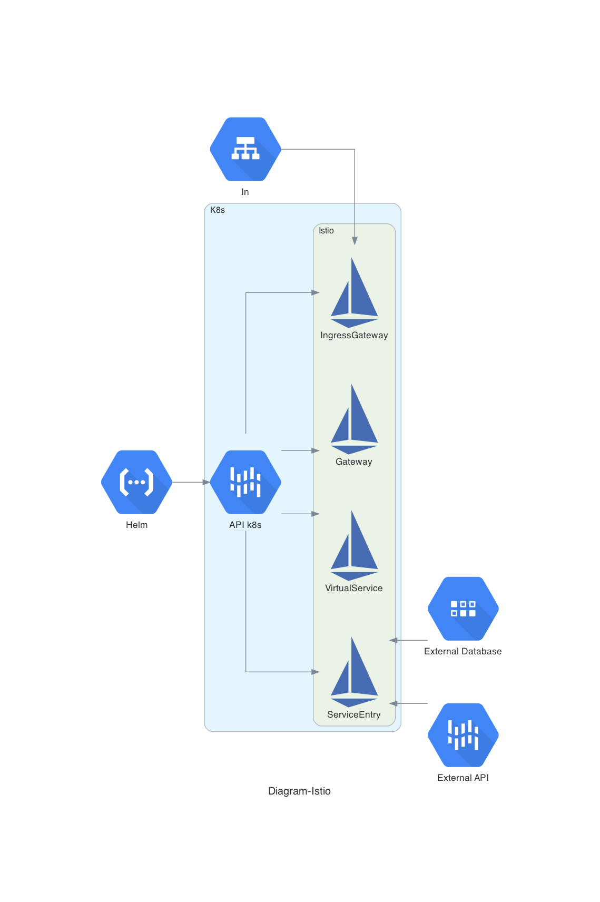

# Linux Polska - wykorzystanie Istio w klastrze K8s
## Makieta rozwiązania, demonstrująca, jak można wykorzystać Istio do określonych założeń projektowych
### Wprowadzenie 
Service Mesh Istio opiera się na dodatkowej warstwie abstrakcji w klastrze kubernetesowym, który sam w sobie jest już abstrakcją. Powoduje to, że samo Istio nie jest łatwe we wdrożeniu oraz późniejszym utrzymaniu. Sam projekt rozwija się bardzo dynamicznie i przy tym bardzo się zmienia (sporo tzw. „breaking changes“ tylko w ostatnim roku). Istio staje się jednak coraz bardziej popularne i szeroko wykorzystywane, zwłaszcza w dużych środowiskach, z dużą ilością mikroserwisów, gdzie daje dużą wartość. Wymienię 3 podstawowe.

* Obustronne szyfrowanie mTLS
* Monitoring
* Zarządzanie ruchem

Zadanie jakie miałem wykonać przedstawia dosyć prosty przepływ:

1. Zautomatyzowane wdrożenie aplikacji wraz z dostępami sieciowymi itp.
2. Udostępnienie wcześniej wdrożonej aplikacji na świat zewnętrzny użytkownikom.
3. Wprowadzenie do klastra k8s i zarazem Istio określonych z góry serwisów (baza danych, integracja API)

Wszystko to w oparciu o Istio, czyli należało wykorzystując wbudowane obiekty Istio w Kubernetes. Poniżej udowadniam na przykładach, jak rozwiązałem powierzone mi zadania.

### 1. Udostępnianie aplikacji pracujących w klastrze k8s użytkownikom
Udostępnianie aplikacji dla użytkownika końcowego w przypadku Istio, najlepiej przeprowadzić za pomocą istio-ingressgateway. Jest możliwość aby „ingressy“ kubernetesowe były przetłumaczone tak, aby Istio je rozumiało gdzie będzie miało kierować ruch. Pozbywamy się jednak większości funkcjonalności Istio. Brak mTLS, obiektów `VirtualService`,  `DestinationRule`, `AuthorizationPolicy`, `PeerAuthentication`. 

Istio bowiem może pracować w dwóch trybach, restrykcyjnym oraz pobłażliwym. Jeszcze przed wersją 1.6.x, czyli stosunkowo niedawno, nie było w ogóle możliwości ruchu sieciowego wewnątrz klastra bez odpowiednich sidecar z envoy. Obecnie w nowych wersjach jest to możliwe.

Poniżej przykład konfiguracji obiektów `Gateway` oraz  `VirtualService`, dzięki tym obiektom udostępniłem testową aplikację „Product Page“ na świat pod adres url [https://istio.olender.io/productpage](https://istio.olender.io/productpage).
```yaml	
apiVersion: networking.istio.io/v1alpha3
kind: Gateway
metadata:
    name: bookinfo-gateway
spec:
    selector:
    istio: ingressgateway # use istio default controller
    servers:
    - port:
        number: 80
        name: http
        protocol: HTTP
    hosts:
    - "istio.olender.io"
    - port:
        name: https
        number: 443
        protocol: HTTPS
    hosts:
        - 'istio.olender.io'
    tls:
        credentialName: istio.olender.io # this should match with Certificate secretName
        mode: SIMPLE
---
apiVersion: networking.istio.io/v1alpha3
kind: VirtualService
metadata:
    name: bookinfo
spec:
    hosts:
    - "istio.olender.io"
    gateways:
    - bookinfo-gateway
    http:
    - match:
    - uri:
        exact: /productpage
    - uri:
        prefix: /static
    - uri:
        exact: /login
    - uri:
        exact: /logout
    - uri:
        prefix: /api/v1/products
    route:
    - destination:
        host: productpage
        port:
            number: 9080
```
### 2. Zautomatyzowana konfiguracja dostępu sieciowego wraz z procesem wdrażania aplikacji
Aby zautomatyzować proces wdrażania aplikacji, wraz z dostępem sieciowym, dobrze jest opracować odpowiednie polityki wraz z obiektami Istio. Od wersji 1.6.x Istio, nie ma dedykowanego helm charta do jego instalacji. Istio instaluje/modyfikuje się za pomocą cli `istioctl`. To przy okazji tworzy nam odpowiednie obiekty wewnątrz klastra K8s. Obecnie najlepsze rozwiązanie na instalację aplikacji w k8s jest jednak Helm. Jest on obecnie niejako standardem w świecie kubernetesa. W chartach prócz standardowej polityki instalacji aplikacji, mogą być zawarte odniesienia do obiektów Istio. Tym sposobem definiujemy odpowiednie polityki, w tym sieciowe, w obiektach Istio. Poniżej przykład helm charta template wraz z politykami sieciowymi dla Istio `DestinationRule`.
```yaml
apiVersion: networking.istio.io/v1alpha3
kind: DestinationRule
metadata:
    name: "{{ template "bookinfo.fullname" . }}"
spec:
    host: {{ .Values.vercelDomain  }}
    trafficPolicy:
    loadBalancer:
        simple: ROUND_ROBIN
    portLevelSettings:
    - port:
        number: 443
        tls:
        mode: SIMPLE
        host: {{ .Values.ingress.hosts }}
```
Sam helm chart może już być aplikowany na różne sposoby wedle ustaleń projektowych. Poczynając od ręcznego deploymentu poprzez cli ‘helm’ po bardziej złożone i zautomatyzowane procesy CI/CD. Dodatkowo, można tak skonfigurować pewne polityki w Istio, aby określone czynności wykonywały się automatycznie. Przykładem może być, oznaczenie danego namespace (przykładowo default) aby automatycznie, wraz z aplikacją uruchamiał się sidecar z envoy.

	kubectl label namespace default istio-injection=enabled

### 3. Bezpieczny dostęp do aplikacji w K8s z poza klastra (baza danych, szyna integracyjna)
 Bezpieczne połączenie z poza klastra k8s jest zależne od trybu ustawienia Accessing External Services w Istio. Są możliwe dwa ustawienia. `REGISTRY_ONLY` gdzie cały ruch przychodzący jest zablokowany i trzeba wprowadzić odpowiednie polityki w obiekcie `ServiceEntry` coś na wzór „white listy“. Oraz drugi z trybów to `ALLOW_ANY`, gdzie cały ruch z zewnątrz jest dopuszczony. Poniżej przykładowa polityka, która dopuszcza do service mesh bazę mongodb, ulokowaną na zewnątrz klastra.
```yaml
apiVersion: networking.istio.io/v1alpha3
kind: ServiceEntry
metadata:
    name: external-svc-mongocluster
spec:
    hosts:
    - mymongodb.somedomain # not used
    addresses:
    - 88.88.88.88 # VIP
    ports:
    - number: 27018
    name: mongodb
    protocol: MONGO
    location: MESH_INTERNAL
    resolution: STATIC
    endpoints:
    - address: 2.2.2.2
    - address: 3.3.3.3
```
oraz dodatkowo możemy zdefiniować powiązaną regułę `DestinationRule`. Służy ona do inicjacji połączenia mTLS z instancjami bazy danych.
```yaml
apiVersion: networking.istio.io/v1alpha3
kind: DestinationRule
metadata:
    name: mtls-mongocluster
spec:
    host: mymongodb.somedomain
    trafficPolicy:
    tls:
        mode: MUTUAL
        clientCertificate: /etc/certs/myclientcert.pem
        privateKey: /etc/certs/client_private_key.pem
        caCertificates: /etc/certs/rootcacerts.pem
```
Analogicznie, możemy również skonfigurować obiekt `ServiceEntry` dla zewnętrznej usługi, która jest dostępna pod określonym socketem. Poniżej przykład obiektu.
```yaml
apiVersion: networking.istio.io/v1alpha3
kind: ServiceEntry
metadata:
    name: unix-domain-socket-example
spec:
    hosts:
    - "example.unix.local"
    location: MESH_EXTERNAL
    ports:
    - number: 80
    name: http
    protocol: HTTP
    resolution: STATIC
    endpoints:
    - address: unix:///var/run/example/socket
```

### Diagram prezentujący rozwiązanie



