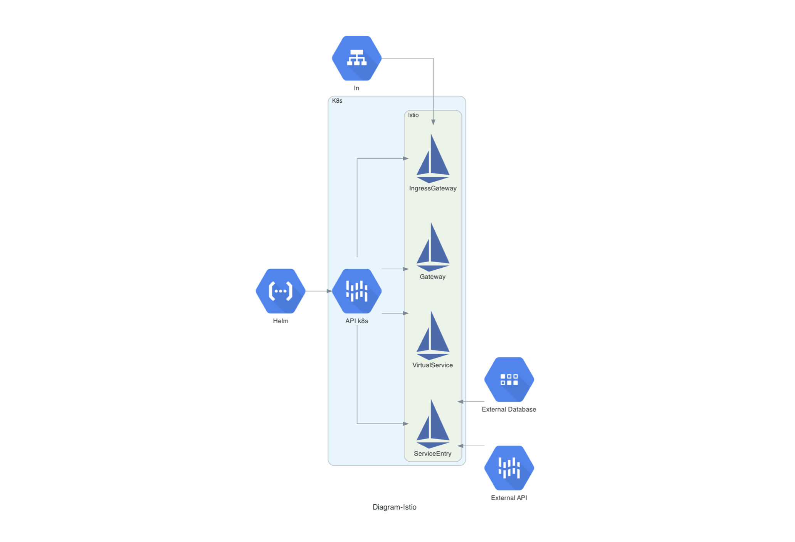

# Linux Polska - wykorzystanie Istio w klastrze K8s
## Makieta rozwiązania, demonstrująca, jak można wykorzystać Istio do poniższych założeń.

### 1. Udostępnianie aplikacji pracujących w klastrze k8s, użytkownikom.
Udostępnianie aplikacji dla użytkownika końcowego w przypadku Istio, najlepiej przeprowadzić za pomocą istio-ingressgateway. Jest możliwość aby „ingressy“ kubernetesowe były przetłumaczone tak, aby Istio je rozumiało gdzie będzie miało kierowało ruch. Pozbywamy się jednak większości funkcjonalności Istio. Brak mTLS, obiektów `VirtualService`,  `DestinationRule`, `AuthorizationPolicy`, `PeerAuthentication`. Istio bowiem może pracować w dwóch trybach, restrykcyjnym oraz pobłażliwym. Poniżej przykład konfiguracji obiektów `Gateway` oraz  `VirtualService`, dzięki tym obiektom udostępniłem usługę na świat pod adres url [https://istio.olender.io/productpage](https://istio.olender.io/productpage).
	
	apiVersion: networking.istio.io/v1alpha3
	kind: Gateway
	metadata:
	  name: bookinfo-gateway
	spec:
	  selector:
	    istio: ingressgateway # use istio default controller
	  servers:
	  - port:
	      number: 80
	      name: http
	      protocol: HTTP
	    hosts:
	    - "istio.olender.io"
	  - port:
	      name: https
	      number: 443
	      protocol: HTTPS
	    hosts:
	      - 'istio.olender.io'
	    tls:
	      credentialName: istio.olender.io # this should match with Certificate secretName
	      mode: SIMPLE
	---
	apiVersion: networking.istio.io/v1alpha3
	kind: VirtualService
	metadata:
	  name: bookinfo
	spec:
	  hosts:
	  - "istio.olender.io"
	  gateways:
	  - bookinfo-gateway
	  http:
	  - match:
	    - uri:
	        exact: /productpage
	    - uri:
	        prefix: /static
	    - uri:
	        exact: /login
	    - uri:
	        exact: /logout
	    - uri:
	        prefix: /api/v1/products
	    route:
	    - destination:
	        host: productpage
	        port:
	          number: 9080

### 2. Zautomatyzowana konfiguracja dostępu sieciowego wraz z procesem wdrażania aplikacji.
Aby zautomatyzować proces wdrażania aplikacji, wraz z dostępem sieciowym, dobrze jest opracować odpowiednie polityki wraz z obiektami Istio. Od wersji 1.6.x Istio, nie ma dedykowanego helm charta do jego instalacji. Istio instaluje się za pomocą cli `istioctl`. To przy okazji tworzy nam odpowiednie obiekty wewnątrz klastra K8s. Obecnie najlepsze rozwiązanie na instalację aplikacji w k8s jest jednak Helm. Jest on obecnie niejako standardem w świecie K8s. W chartach prócz standardowej polityki instalacji aplikacji, mogą być zawarte odniesienia do obiektów Istio. Tym sposobem definiując odpowiednie polityki, w tym sieciowe, w obiektach Istio.
Poniżej przykład helm charta z wraz z politykami sieciowymi dla Istio `DestinationRule`. 

	apiVersion: networking.istio.io/v1alpha3
	kind: DestinationRule
	metadata:
	  name: "{{ template "bookinfo.fullname" . }}"
	spec:
	  host: {{ .Values.vercelDomain  }}
	  trafficPolicy:
	    loadBalancer:
	      simple: ROUND_ROBIN
	    portLevelSettings:
	    - port:
	        number: 443
	      tls:
	        mode: SIMPLE
	        host: {{ .Values.ingress.hosts }}

Sam helm chart może już być aplikowany na różne sposoby wedle założeń projektowych. Poczynając dd ręcznego deploymentu poprzez cli i komendę ‘helm’ po bardziej złożone i zautomatyzowane procesy CI/CD.

### 3. Bezpieczny dostęp do aplikacji w K8s z poza klastra (baza danych, szyna integracyjna)
 Bezpieczne połączenie z poza klastra k8s jest zależne od trybu ustawienia Accessing External Services w Istio. Są możliwe dwa ustawienia. `REGISTRY_ONLY` gdzie cały ruch przychodzący jest zablokowany i trzeba wprowadzić odpowiednie polityki w obiekcie `ServiceEntry` coś na wzór „white listy“. Oraz drugi z trybów to `ALLOW_ANY`, gdzie cały ruch z zewnątrz jest dopuszczony. Poniżej przykładowa polityka która dopuszcza do service mesh bazę mongodb, ulokowaną na zewnątrz klastra.

	apiVersion: networking.istio.io/v1alpha3
	kind: ServiceEntry
	metadata:
	  name: external-svc-mongocluster
	spec:
	  hosts:
	  - mymongodb.somedomain # not used
	  addresses:
	  - 88.88.88.88 # VIP
	  ports:
	  - number: 27018
	    name: mongodb
	    protocol: MONGO
	  location: MESH_INTERNAL
	  resolution: STATIC
	  endpoints:
	  - address: 2.2.2.2
	  - address: 3.3.3.3

oraz dodatkowo możemy zdefiniować powiązaną regułę `DestinationRule`. Służy ona do inicjacji połączenia mTLS z instancjami bazy danych.

	apiVersion: networking.istio.io/v1alpha3
	kind: DestinationRule
	metadata:
	  name: mtls-mongocluster
	spec:
	  host: mymongodb.somedomain
	  trafficPolicy:
	    tls:
	      mode: MUTUAL
	      clientCertificate: /etc/certs/myclientcert.pem
	      privateKey: /etc/certs/client_private_key.pem
	      caCertificates: /etc/certs/rootcacerts.pem

Analogicznie, możemy również skonfigurować obiekt `ServiceEntry` dla zewnętrznej usługi, która jest dostępna pod określonym socketem. Poniżej przykład obiektu.

	apiVersion: networking.istio.io/v1alpha3
	kind: ServiceEntry
	metadata:
	  name: unix-domain-socket-example
	spec:
	  hosts:
	  - "example.unix.local"
	  location: MESH_EXTERNAL
	  ports:
	  - number: 80
	    name: http
	    protocol: HTTP
	  resolution: STATIC
	  endpoints:
	  - address: unix:///var/run/example/socket

### Diagram prezentujący rozwiązanie

Przygotowując się do prezentacji zadania, proszę też pamiętać, że dobrze byłoby zrobić wprowadzenie dla jej uczestników, tj. opowiedzieć o samym zadaniu, założeniach, jakie mu towarzyszyły, tezie jaka, jest udowadniana. To wprowadzenie może być zrobione ustnie nie oczekujemy prezentacji wizualnej w tym zakresie.